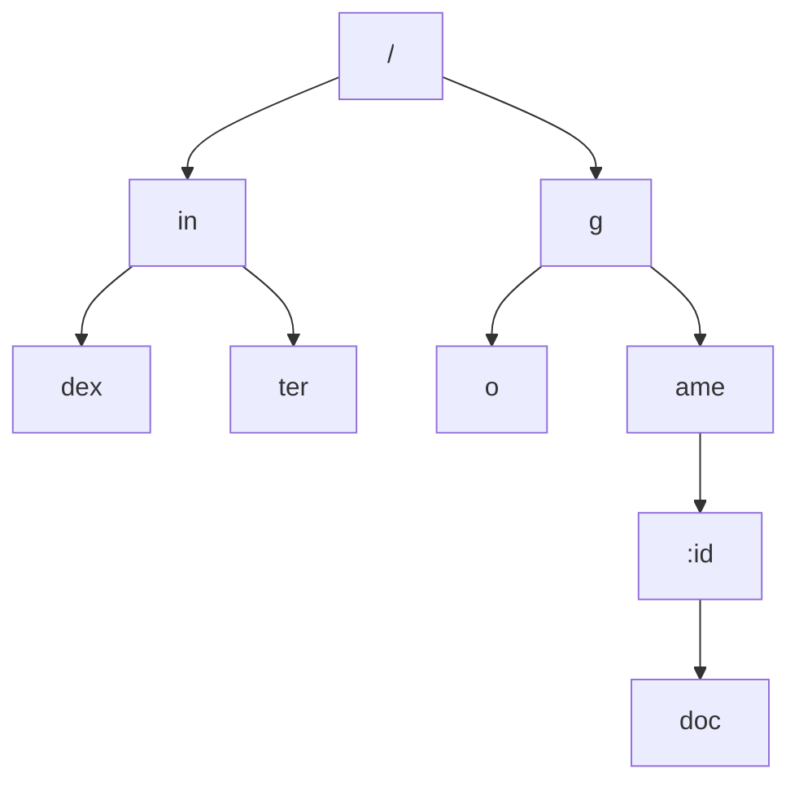
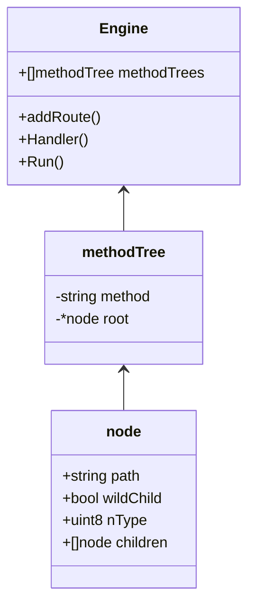

#### node结构体

```go {}    
type node struct {
    path      string             // 当前节点相对路径（与祖先节点的 path 拼接可得到完整路径）
    indices   string             // 所以孩子节点的path[0]组成的字符串
    wildChild bool               // 孩子节点是否有通配符（wildcard）
    nType     nodeType           // 节点类型
    priority  uint32             // 当前节点及子孙节点的实际路由数量
    children  []*node            // 孩子节点
    handlers  HandlersChain      // 当前节点的处理函数（包括中间件）
    fullPath  string             // 当前节点完整路径
}
```

#### 请求路由

```go {}
r.GET("/", func (context *gin.Context) {})
r.GET("/index", func (context *gin.Context) {})
r.GET("/inter", func (context *gin.Context) {})
r.GET("/go", func (context *gin.Context) {})
r.GET("/game/:id/doc", func (context *gin.Context) {})
```

#### gin.node结构

Gin的路由实现使用了类似前缀树的数据结构，只需遍历一遍字符串即可，时间复杂度为O(n)。





#### handlers

handlers里存储了该节点对应路由下的所有处理函数，处理业务逻辑时是这样的

```go 
// Next should be used only inside middleware.
// It executes the pending handlers in the chain inside the calling handler.
// See example in GitHub.
func (c *Context) Next() {
	c.index++
	for c.index < int8(len(c.handlers)) {
		c.handlers[c.index](c)
		c.index++
	}
}
```


<script src="https://cdn.jsdelivr.net/npm/mermaid/dist/mermaid.min.js"></script>
<script>
    mermaid.initialize({ startOnLoad: true });
</script>