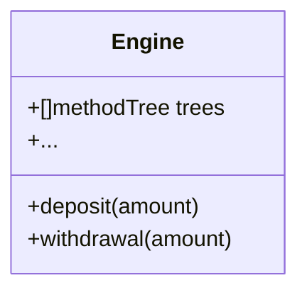
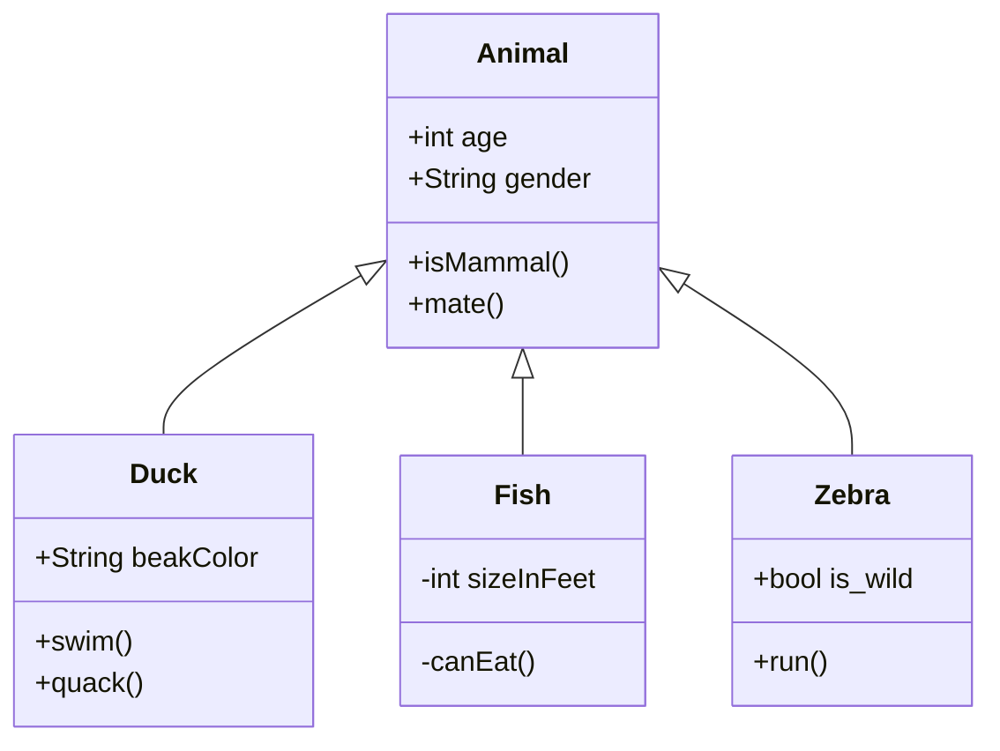

## 注释

- 单行注释 #
- 多行注释 在注释内容的开始和结尾分别使用三个单引号或双引号

```python {linenos=true}
print("hello world")

def print(self, *args, sep=' ', end='\n', file=None): # known special case of print
    """
    print(value, ..., sep=' ', end='\n', file=sys.stdout, flush=False)
    
    Prints the values to a stream, or to sys.stdout by default.
    Optional keyword arguments:
    file:  a file-like object (stream); defaults to the current sys.stdout.
    sep:   string inserted between values, default a space.
    end:   string appended after the last value, default a newline.
    flush: whether to forcibly flush the stream.
    """
```

## 格式化方法

有时候我们会想要从其他信息中构建字符串。这正是 format() 方法大有用武之地的地方。

```python {linenos=true}
age = 20
name = 'Swaroop'
print('{0} was {1} years old when he wrote this book'.format(name, age))
print('Why is {0} playing with that python?'.format(name))
```

```
Swaroop was 20 years old when he wrote this book
Why is Swaroop playing with that python?
```



``` mermaid
classDiagram 
classA <|-- classB   
classC *-- classD   
classE  o -- classF  
classG <-- classH   
classI -- classJ   
classK <.. classL   
classM <|.. classN   
classO .. class
```


{{ if .Page.Store.Get "hasMermaid" }}
  <script src="https://cdn.jsdelivr.net/npm/mermaid/dist/mermaid.min.js"></script>
  <script>
    mermaid.initialize({ startOnLoad: true });
  </script>
{{ end }}