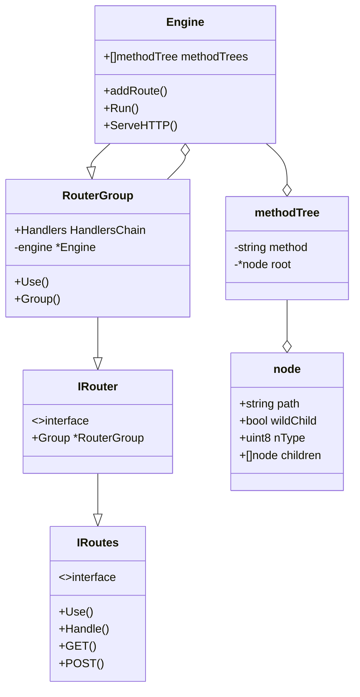
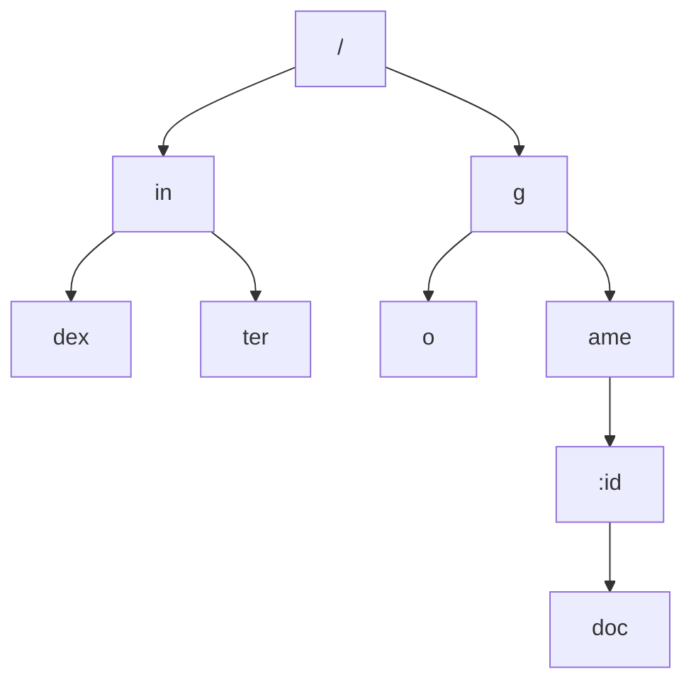

## 1、服务启动过程

```go
func main() {
	r := gin.Default()

	r.GET("/ping", func(c *gin.Context) {
		c.JSON(http.StatusOK, gin.H{
			"message": "pong",
		})
	})

	r.Run()
}
```

### 1. gin.Default()

`gin.Default()` 函数会生成一个默认的 `Engine` 对象，里面包含了 2 个默认的常用插件，分别是 `Logger` 和 `Recovery`，`Logger` 用于输出请求日志，
`Recovery` 确保单个请求发生 `panic` 时记录异常堆栈日志，输出统一的错误响应。

```go 
// Default returns an Engine instance with the Logger and Recovery middleware already attached.
func Default() *Engine {
	// 输出debug日志
	debugPrintWARNINGDefault()
	// 创建一个默认无路由无中间件的引擎
	engine := New()
	// 默认注册全局日志和异常捕获中间件
	engine.Use(Logger(), Recovery())
	return engine
}
```
<mark>Gin框架中注册中间件是通过 engine.Use(xx)的方式。</mark>

ginMode分为三种场景下的模式，默认为debug模式，可以通过环境变量或代码声明的方式修改模式
``` {linenos=false}
debugCode = iota
releaseCode
testCode

[GIN-debug] [WARNING] Running in "debug" mode. Switch to "release" mode in production.
 - using env:   export GIN_MODE=release
 - using code:  gin.SetMode(gin.ReleaseMode)
```

### 2. engine.GET()

`router.Handle(httpMethod, relativePath, handlers)` 用来创建路由，同时框架提供了 `GET`, `POST` 等简单方法，`relativePath` 和 `handlers`
分别与 `router` 中 `basePath` 、`handlers` 共同组成最终的 `absolutePath` 和 `handlers`。

```go
// Unless otherwise noted, these are defined in RFC 7231 section 4.3.
const (
	MethodGet     = "GET"
	MethodHead    = "HEAD"
	MethodPost    = "POST"
	MethodPut     = "PUT"
	MethodPatch   = "PATCH" // RFC 5789
	MethodDelete  = "DELETE"
	MethodConnect = "CONNECT"
	MethodOptions = "OPTIONS"
	MethodTrace   = "TRACE"
)
```

```go
// GET is a shortcut for router.Handle("GET", path, handle).
// 注册一个匹配路径为 relativePath 的GET请求路由
func (group *RouterGroup) GET(relativePath string, handlers ...HandlerFunc) IRoutes {
	return group.handle(http.MethodGet, relativePath, handlers)
}
// -----
func (group *RouterGroup) handle(httpMethod, relativePath string, handlers HandlersChain) IRoutes {
	//以'/'连接group.basePath 与 relativePath
    absolutePath := group.calculateAbsolutePath(relativePath)
	// 合并 group.Handlers 与 handlers
    handlers = group.combineHandlers(handlers)
	// 将请求路由添加到engine中
    group.engine.addRoute(httpMethod, absolutePath, h   andlers)
    return group.returnObj()
}
```

### 3. engine.Run()
```go
// Run attaches the router to a http.Server and starts listening and serving HTTP requests.
// It is a shortcut for http.ListenAndServe(addr, router)
// Note: this method will block the calling goroutine indefinitely unless an error happens.
func (engine *Engine) Run(addr ...string) (err error) {
    // 打印error日志
    defer func() { debugPrintError(err) }()
    // 我们可以通过 router.SetTrustedProxies([]string{"192.168.1.2"}) 设置受信任的代理
    if engine.isUnsafeTrustedProxies() {
        debugPrint("[WARNING] You trusted all proxies, this is NOT safe. We recommend you to set a value.\n" +
            "Please check https://pkg.go.dev/github.com/gin-gonic/gin#readme-don-t-trust-all-proxies for details.")
	}
    // 解析端口地址，默认使用环境变量PORT，或:8080
    address := resolveAddress(addr)
    debugPrint("Listening and serving HTTP on %s\n", address)
    // 监听端口地址，engine.Handler作为请求处理函数
    err = http.ListenAndServe(address, engine.Handler())
    return
}
```

### 4.总结
`Engine` 是 `Gin` 框架的核心数据结构，通过 `Engine` 对象定义服务路由信息后，使用 `http server` 启动服务并监听端口地址。

`Engine` 的本质只是对内置的 `HTTP` 服务器的包装，让它使用起来更加便捷。`HTTP` 服务器使用的是 `Go` 语言内置的 `http server`，


## 2、结构体


### 1. gin.Engine

`Engine` 是 `Gin` 框架最重要的数据结构，它是框架的入口。我们通过 `Engine` 对象来定义服务路由信息、组装插件、运行服务。
正如 `Engine` 的中文意思「引擎」一样，它就是框架的核心发动机，整个 Web 服务的都是由它来驱动的。

```go
// Engine is the framework's instance, it contains the muxer, middleware and configuration settings.
// Create an instance of Engine, by using New() or Default()
type Engine struct {
    RouterGroup
    ...
}
```
### 2. gin.RouterGroup

`RouterGroup` 是 `Engine` 的父类，是对路由树的包装，所有的路由规则最终都是由它来进行管理。

```go
// RouterGroup is used internally to configure router, a RouterGroup is associated with
// a prefix and an array of handlers (middleware).
type RouterGroup struct {
    Handlers HandlersChain
    basePath string
    engine   *Engine
    root     bool
}
```
RouterGroup 实现了 IRoutes 接口，暴露了一系列路由方法，这些方法最终都是通过调用 Engine.addRoute 方法将请求处理器挂接到路由树中。
```go
// IRoutes defines all router handle interface.
type IRoutes interface {
	Use(...HandlerFunc) IRoutes

	Handle(string, string, ...HandlerFunc) IRoutes
	Any(string, ...HandlerFunc) IRoutes
	GET(string, ...HandlerFunc) IRoutes
	POST(string, ...HandlerFunc) IRoutes
	DELETE(string, ...HandlerFunc) IRoutes
	PATCH(string, ...HandlerFunc) IRoutes
	PUT(string, ...HandlerFunc) IRoutes
	OPTIONS(string, ...HandlerFunc) IRoutes
	HEAD(string, ...HandlerFunc) IRoutes

	StaticFile(string, string) IRoutes
	StaticFileFS(string, string, http.FileSystem) IRoutes
	Static(string, string) IRoutes
	StaticFS(string, http.FileSystem) IRoutes
}
```

### 3. gin.node 路由树

在 `Gin` 框架中，路由规则被分成了最多 9 棵前缀树，每一个 `HTTP Method` 对应一棵「前缀树」，树的节点按照 `URL` 中的 / 符号进行层级划分，
`URL` 支持 `:name` 形式的名称匹配， 还支持 `*subpath` 形式的路径通配符 。

Gin的路由只需遍历一遍字符串即可，时间复杂度为O(n)。
```go
func New() *Engine {
	...
    engine := &Engine{
		...
        trees:  make(methodTrees, 0, 9),
		...
    }
}
```
```go  
  
type node struct {
    path      string             // 当前节点相对路径（与祖先节点的 path 拼接可得到完整路径）
    indices   string             // 所以孩子节点的path[0]组成的字符串
    wildChild bool               // 孩子节点是否有通配符（wildcard）
    nType     nodeType           // 节点类型
    priority  uint32             // 当前节点及子孙节点的实际路由数量
    children  []*node            // 孩子节点
    handlers  HandlersChain      // 当前节点的处理函数（包括中间件）
    fullPath  string             // 当前节点完整路径
}
```

### 4. 示例
```go {}
r.GET("/", func (context *gin.Context) {})
r.GET("/index", func (context *gin.Context) {})
r.GET("/inter", func (context *gin.Context) {})
r.GET("/go", func (context *gin.Context) {})
r.GET("/game/:id/doc", func (context *gin.Context) {})
```




<script src="https://cdn.jsdelivr.net/npm/mermaid/dist/mermaid.min.js"></script>
<script>
    mermaid.initialize({ startOnLoad: true });
</script>

## 3、路由过程

```go
func (engine *Engine) handleHTTPRequest(c *Context) {
	...
	// Find root of the tree for the given HTTP method
	t := engine.trees
	for i, tl := 0, len(t); i < tl; i++ {
		// 过滤method
		if t[i].method != httpMethod {
			continue
		}
		root := t[i].root
		// Find route in tree
		// 匹配最佳路由
		value := root.getValue(rPath, c.params, c.skippedNodes, unescape)
		if value.params != nil {
			c.Params = *value.params
		}
		if value.handlers != nil {
			c.handlers = value.handlers
			c.fullPath = value.fullPath
			c.Next()
			c.writermem.WriteHeaderNow()
			return
		}
		if httpMethod != http.MethodConnect && rPath != "/" {
			if value.tsr && engine.RedirectTrailingSlash {
				redirectTrailingSlash(c)
				return
			}
			if engine.RedirectFixedPath && redirectFixedPath(c, root, engine.RedirectFixedPath) {
				return
			}
		}
		break
	}
	...
}

```
```go

func (n *node) getValue(path string, params *Params, skippedNodes *[]skippedNode, unescape bool) (value nodeValue) {
	var globalParamsCount int16

walk: // Outer loop for walking the tree
	for {
		prefix := n.path
		// 
		if len(path) > len(prefix) {
			if path[:len(prefix)] == prefix {
				path = path[len(prefix):]

				// Try all the non-wildcard children first by matching the indices
				idxc := path[0]
				for i, c := range []byte(n.indices) {
					if c == idxc {
						//  strings.HasPrefix(n.children[len(n.children)-1].path, ":") == n.wildChild
						if n.wildChild {
							index := len(*skippedNodes)
							*skippedNodes = (*skippedNodes)[:index+1]
							(*skippedNodes)[index] = skippedNode{
								path: prefix + path,
								node: &node{
									path:      n.path,
									wildChild: n.wildChild,
									nType:     n.nType,
									priority:  n.priority,
									children:  n.children,
									handlers:  n.handlers,
									fullPath:  n.fullPath,
								},
								paramsCount: globalParamsCount,
							}
						}

						n = n.children[i]
						continue walk
					}
				}

				if !n.wildChild {
					// If the path at the end of the loop is not equal to '/' and the current node has no child nodes
					// the current node needs to roll back to last valid skippedNode
					if path != "/" {
						for l := len(*skippedNodes); l > 0; {
							skippedNode := (*skippedNodes)[l-1]
							*skippedNodes = (*skippedNodes)[:l-1]
							if strings.HasSuffix(skippedNode.path, path) {
								path = skippedNode.path
								n = skippedNode.node
								if value.params != nil {
									*value.params = (*value.params)[:skippedNode.paramsCount]
								}
								globalParamsCount = skippedNode.paramsCount
								continue walk
							}
						}
					}

					// Nothing found.
					// We can recommend to redirect to the same URL without a
					// trailing slash if a leaf exists for that path.
					value.tsr = path == "/" && n.handlers != nil
					return
				}

				// Handle wildcard child, which is always at the end of the array
				n = n.children[len(n.children)-1]
				globalParamsCount++

				switch n.nType {
				case param:
					// fix truncate the parameter
					// tree_test.go  line: 204

					// Find param end (either '/' or path end)
					end := 0
					for end < len(path) && path[end] != '/' {
						end++
					}

					// Save param value
					if params != nil && cap(*params) > 0 {
						if value.params == nil {
							value.params = params
						}
						// Expand slice within preallocated capacity
						i := len(*value.params)
						*value.params = (*value.params)[:i+1]
						val := path[:end]
						if unescape {
							if v, err := url.QueryUnescape(val); err == nil {
								val = v
							}
						}
						(*value.params)[i] = Param{
							Key:   n.path[1:],
							Value: val,
						}
					}

					// we need to go deeper!
					if end < len(path) {
						if len(n.children) > 0 {
							path = path[end:]
							n = n.children[0]
							continue walk
						}

						// ... but we can't
						value.tsr = len(path) == end+1
						return
					}

					if value.handlers = n.handlers; value.handlers != nil {
						value.fullPath = n.fullPath
						return
					}
					if len(n.children) == 1 {
						// No handle found. Check if a handle for this path + a
						// trailing slash exists for TSR recommendation
						n = n.children[0]
						value.tsr = (n.path == "/" && n.handlers != nil) || (n.path == "" && n.indices == "/")
					}
					return

				case catchAll:
					// Save param value
					if params != nil {
						if value.params == nil {
							value.params = params
						}
						// Expand slice within preallocated capacity
						i := len(*value.params)
						*value.params = (*value.params)[:i+1]
						val := path
						if unescape {
							if v, err := url.QueryUnescape(path); err == nil {
								val = v
							}
						}
						(*value.params)[i] = Param{
							Key:   n.path[2:],
							Value: val,
						}
					}

					value.handlers = n.handlers
					value.fullPath = n.fullPath
					return

				default:
					panic("invalid node type")
				}
			}
		}

		if path == prefix {
			// If the current path does not equal '/' and the node does not have a registered handle and the most recently matched node has a child node
			// the current node needs to roll back to last valid skippedNode
			if n.handlers == nil && path != "/" {
				for l := len(*skippedNodes); l > 0; {
					skippedNode := (*skippedNodes)[l-1]
					*skippedNodes = (*skippedNodes)[:l-1]
					if strings.HasSuffix(skippedNode.path, path) {
						path = skippedNode.path
						n = skippedNode.node
						if value.params != nil {
							*value.params = (*value.params)[:skippedNode.paramsCount]
						}
						globalParamsCount = skippedNode.paramsCount
						continue walk
					}
				}
				//	n = latestNode.children[len(latestNode.children)-1]
			}
			// We should have reached the node containing the handle.
			// Check if this node has a handle registered.
			if value.handlers = n.handlers; value.handlers != nil {
				value.fullPath = n.fullPath
				return
			}

			// If there is no handle for this route, but this route has a
			// wildcard child, there must be a handle for this path with an
			// additional trailing slash
			if path == "/" && n.wildChild && n.nType != root {
				value.tsr = true
				return
			}

			// No handle found. Check if a handle for this path + a
			// trailing slash exists for trailing slash recommendation
			for i, c := range []byte(n.indices) {
				if c == '/' {
					n = n.children[i]
					value.tsr = (len(n.path) == 1 && n.handlers != nil) ||
						(n.nType == catchAll && n.children[0].handlers != nil)
					return
				}
			}

			return
		}

		// Nothing found. We can recommend to redirect to the same URL with an
		// extra trailing slash if a leaf exists for that path
		value.tsr = path == "/" ||
			(len(prefix) == len(path)+1 && prefix[len(path)] == '/' &&
				path == prefix[:len(prefix)-1] && n.handlers != nil)

		// roll back to last valid skippedNode
		if !value.tsr && path != "/" {
			for l := len(*skippedNodes); l > 0; {
				skippedNode := (*skippedNodes)[l-1]
				*skippedNodes = (*skippedNodes)[:l-1]
				if strings.HasSuffix(skippedNode.path, path) {
					path = skippedNode.path
					n = skippedNode.node
					if value.params != nil {
						*value.params = (*value.params)[:skippedNode.paramsCount]
					}
					globalParamsCount = skippedNode.paramsCount
					continue walk
				}
			}
		}

		return
	}
}

```

